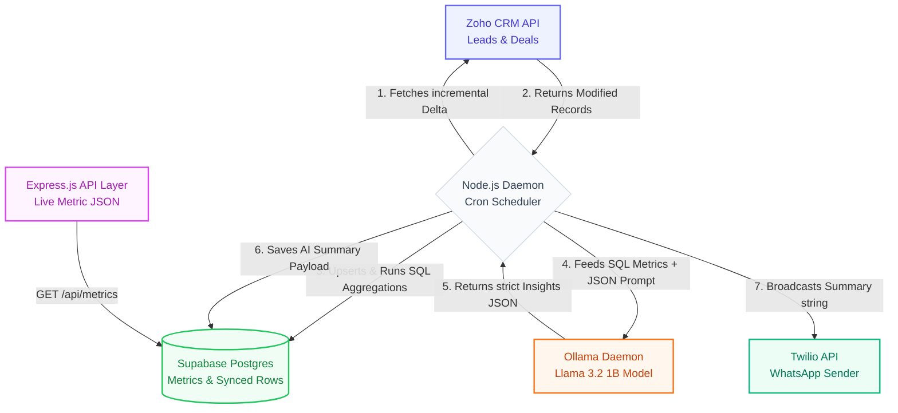

# AI-Powered CRM Intelligence Agent

A production-grade, end-to-end automated CRM Intelligence pipeline that extracts daily data from Zoho CRM, parses it incrementally into a Supabase data warehouse, synthesizes the metrics into actionable insights using a local Llama 3.2 AI, and delivers the results via WhatsApp.

---

## � Workflow Overview

The system operates as a daily automated pipeline, moving data from the source CRM through an AI analysis layer to final delivery.



---

## 🛠 Setup Instructions

### 1. Prerequisites
- **Node.js** (v18+)
- **Ollama** running locally with the `llama3.2:1b` model (`ollama run llama3.2:1b`)
- **Supabase** account and project
- **Zoho CRM** account with API access
- **Twilio** account for WhatsApp delivery

### 2. Installation
Clone the repository and install dependencies in the backend:
```bash
cd backend
npm install
```

### 3. Environment Variables
Create a `.env` file in the `backend/` directory with the following configuration:
```env
# Zoho CRM Credentials
ZOHO_CLIENT_ID=your_id
ZOHO_CLIENT_SECRET=your_secret
ZOHO_REFRESH_TOKEN=your_refresh

# Supabase Credentials
SUPABASE_URL=your_supabase_url
SUPABASE_SERVICE_KEY=your_service_key

# Local AI Configuration
OLLAMA_BASE_URL=http://localhost:11434

# Twilio WhatsApp Credentials
TWILIO_ACCOUNT_SID=your_sid
TWILIO_AUTH_TOKEN=your_token
TWILIO_FROM_NUMBER=whatsapp:+14155238886
RECIPIENT_PHONE_NUMBER=your_whatsapp_number
```

### 4. Database Setup
Execute the schema provided in `backend/src/utils/schema.sql` (if available) within your Supabase SQL editor to initialize the required tables (`leads`, `deals`, `sync_state`, `ai_summaries`).

### 5. Running the System
The system can be started from the root directory or directly from the backend.

**Start the API Server:**
```bash
cd backend
npm run start:backend
# or from root: npm start
```

**Run the Data Pipeline Manually:**
```bash
cd backend
npm run start:pipeline
```

---

## 📂 File Structure

### Root Directory
- `backend/`: Core logic and API server.
- `package.json`: Root runner configuration.
- `README.md`: System documentation.

### Backend Structure (`backend/src/`)
- `ai/`: AI analysis service using Ollama and Llama 3.2.
- `analytics/`: Service for calculating KPIs and SQL aggregations.
- `api/`: Express.js server and API route definitions.
- `auth/`: OAuth2 handling for Zoho CRM.
- `config/`: Centralized configuration and environment loading.
- `ingestion/`: Logic for fetching and upserting CRM data.
- `scheduler/`: Cron job for automated daily execution.
- `utils/`: Common helpers, database clients, and SQL schemas.
- `whatsapp/`: Twilio integration for automated summary broadcasts.

---

## 🧠 Design Philosophy
The system prioritizes **data security** and **predictability**:
- **Local AI**: All lead and revenue data is processed locally via Ollama, ensuring sensitive information never leaves your infrastructure.
- **Strict Schema Forcing**: The AI is prompted to return structured JSON, ensuring the output is always deterministic and stable for API consumption.
- **Incremental Sync**: Only modified CRM records are fetched, minimizing API usage and database load.
