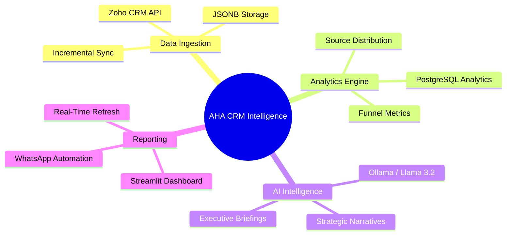

# 🏠 AHA Smart Homes — AI-Powered CRM Intelligence Platform

[](https://streamlit.io/)
[](https://supabase.com/)
[](https://ollama.com/)
[](https://www.twilio.com/)
[](https://www.zoho.com/crm/)

> **"Extract everything. Store everything. Understand everything."**

A fully automated, production-grade CRM intelligence system that pulls all data from Zoho CRM across every module, stores it with zero data loss in a Supabase PostgreSQL cloud database, performs deep SQL analytics, and generates AI-driven executive insights using a private local Llama 3.2 model.

---

## ✨ Key Features

- **🚀 Real-Time Dashboard**: 15+ dynamic Plotly charts with zero-cache latency for critical KPIs.
- **🧠 Local AI Analyst**: Private, on-device strategic briefings via Ollama (Llama 3.2).
- **📱 WhatsApp Strategic Pulse**: 3-point mobile briefings (Metrics, Signals, Focus) sent daily.
- **💬 Interactive Commands**: Type `UPDATE` in WhatsApp to trigger an on-demand sync and briefing.
- **📊 JSONB ELT Pattern**: Dynamic module extraction ensuring no data is ever lost.

---

## 📸 Executive Dashboard Preview


---

## 🧠 Strategic Mind Map



---

## 🏗️ System Architecture

```mermaid
graph TD
    subgraph "Data Acquisition"
        A[Zoho CRM (Live API)]
    end

    subgraph "Incremental Sync"
        B[Incremental Sync (If-Modified-Since)]
    end

    subgraph "Data Storage"
        C["Supabase Cloud (PostgreSQL)"]
        D["raw_data JSONB"]
    end

    subgraph "Analytics & AI"
        E["SQL Funnel Analytics"]
        F["Llama 3.2 (Local Ollama)"]
    end

    subgraph "Reporting & Alerts"
        G["Streamlit Dashboard"]
        H["WhatsApp (Twilio)"]
    end

    A --> B
    B --> C
    C --> D
    C --> E
    E --> F
    F --> G
    F --> H
```

---

## 📂 Project Structure

```text
AHA Smart Homes Project /
├── backend/
│   ├── src/
│   │   ├── ai/
│   │   │   └── ollamaClient.js      # Executive Briefing Generator (Llama 3.2 Agent)
│   │   ├── analytics/
│   │   │   └── metrics.js           # Funnel & Revenue Logic (PostgreSQL + JS)
│   │   ├── api/
│   │   │   ├── aiRoutes.js          # REST API for insights & triggers
│   │   │   └── server.js            # Express API Server (Webhook & Sync Trigger)
│   │   ├── auth/
│   │   │   └── zohoAuth.js          # Zoho OAuth 2.0 Client & Token Rotation
│   │   ├── config/
│   │   │   └── env.js               # Centralized Environment config & validation
│   │   ├── ingestion/
│   │   │   ├── leads.js             # Zoho Leads Dynamic Module Extraction
│   │   │   └── deals.js             # Zoho Deals Ingestion logic
│   │   ├── scheduler/
│   │   │   └── index.js             # Main Orchestrator: Sync → SQL → AI → WhatsApp
│   │   ├── utils/
│   │   │   ├── schema.sql           # Database schema definitions (JSONB ELT)
│   │   │   └── supabaseClient.js    # Supabase (PostgreSQL) Client adapter
│   │   └── whatsapp/
│   │       └── twilioClient.js      # Twilio WhatsApp Dispatcher
│   ├── package.json                 # Backend dependencies & pipeline scripts
│   └── .env                         # Sensitive configuration (NOT committed)
└── dashboard.py                     # Premium Streamlit Dashboard (15+ Charts)
```

---

## ⚙️ Setup & Installation

### Prerequisites
- **Python 3.10+**
- **[Ollama](https://ollama.com/)** with `llama3.2:1b` pulled locally
- A **Zoho CRM** account with API credentials
- A **Supabase** project
- A **Twilio** account with WhatsApp Sandbox enabled

### 1. Install Dependencies
```bash
# Install Python dependencies
pip install streamlit pandas plotly supabase requests python-dotenv

# Install Node.js backend dependencies
cd backend
npm install
```

### 2. Configure Environment Variables
Create a `.env` file in the `backend/` directory with your Zoho, Supabase, and Twilio credentials.

### 3. Apply Database Schema
Open your Supabase project → SQL Editor → paste the contents of `backend/src/utils/schema.sql` → click **Run**.

---

## 🚀 Running the System

| Mode | Command | Description |
| :--- | :--- | :--- |
| **Backend API** | `npm run start:api` | Handles WhatsApp webhooks & triggers |
| **Dashboard** | `streamlit run dashboard.py` | Launches the live UI |
| **Manual Sync** | `npm run start:pipeline` | Triggers a fresh data & AI run |

---

## 🛠️ Tech Stack & Decisions

### Core Infrastructure
- **CRM**: Zoho CRM API v2 for reliable data extraction.
- **Data Engine**: Supabase (PostgreSQL) with ELT pattern for maximum scalability.
- **AI Brain**: Llama 3.2 running locally—zero latency, zero cost.
- **UI**: Streamlit with custom "Vibrant Midnight" CSS for a premium feel.

> [!IMPORTANT]
> **Privacy First**: All AI analysis is performed 100% locally on your machine. No CRM data ever leaves your infrastructure for processing.
