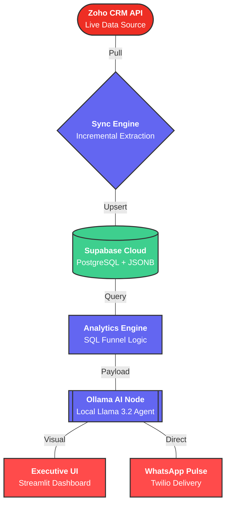

# 🏠 AHA Smart Homes — AI-Powered CRM Intelligence Platform

[](https://nodejs.org/)
[](https://www.python.org/)
[](https://supabase.com/)
[](https://ollama.com/)
[](https://www.zoho.com/crm/)

A professional-grade CRM intelligence system that automates the pipeline from data extraction to executive decision-making. The platform synchronizes live data from Zoho CRM, performs complex revenue analytics in a Supabase PostgreSQL environment, and generates strategic insights using a local Llama 3.2 model for 100% data privacy.

---

## 🏗️ System Architecture



---


## 🏗️ System Architecture

The system follows a modular, decoupled architecture to ensure scalability and reliability:

1.  **Ingestion Layer**: A Node.js engine performs incremental syncs from Zoho CRM using OAuth 2.0 and high-water mark tracking.
2.  **Storage Layer**: Supabase (PostgreSQL) manages relational CRM data and structured AI payloads.
3.  **Analytics Layer**: A specialized JavaScript engine calculates funnel velocity, win rates, and pipeline health.
4.  **Intelligence Layer**: Local Llama 3.2 (via Ollama) processes quantitative metrics into qualitative strategic briefs.
5.  **Interface Layer**: A multi-tab Streamlit dashboard provides real-time visualization and manual pipeline triggers.
6.  **Notification Layer**: Twilio WhatsApp API delivers daily "Revenue Pulse" summaries directly to executive mobile devices.

---

## 📂 Project Structure

## 📂 Project Structure

```bash
AHA Smart Homes Project/
├── backend/
│   ├── src/
│   │   ├── ai/ollamaClient.js
│   │   ├── analytics/metrics.js
│   │   ├── api/
│   │   ├── auth/zohoAuth.js
│   │   ├── ingestion/syncService.js
│   │   ├── scheduler/index.js
│   │   └── whatsapp/twilioClient.js
│   └── .env
└── dashboard.py
```

## ⚙️ Setup & Installation

### Prerequisites
- **Python 3.10+**
- **[Ollama](https://ollama.com/)** with `llama3.2:1b` pulled locally
- **Zoho CRM** account with API credentials
- **Supabase** project
- **Twilio** account with WhatsApp Sandbox enabled

### 1. Install Dependencies
```bash
# Install Python dependencies
pip install streamlit pandas plotly supabase requests python-dotenv

# Install Node.js backend dependencies
cd backend
npm install
```

### 2. Configure Environment Variables
Create a `.env` file in the `backend/` directory with your Zoho, Supabase, and Twilio credentials.

### 3. Apply Database Schema
Open your Supabase project → SQL Editor → paste the contents of `backend/src/utils/schema.sql` → click **Run**.

---

## 🚀 Running the System

| Mode | Command | Description |
| :--- | :--- | :--- |
| **Backend API** | `npm run start:api` | Handles WhatsApp webhooks & triggers |
| **Dashboard** | `streamlit run dashboard.py` | Launches the live UI |
| **Manual Sync** | `npm run start:pipeline` | Triggers a fresh data & AI run |

---

## 🛠️ Tech Stack & Design Justification

### Core Infrastructure
- **Node.js (Backend)**: Chosen for its asynchronous non-blocking I/O, ideal for orchestrating multiple API calls (Zoho, Supabase, Twilio) and handling concurrent WhatsApp webhooks.
- **Python/Streamlit (Frontend)**: Selected for rapid iteration of data-heavy dashboards. Enhanced with custom CSS for a **Premium Glassmorphism** look and fee.
- **Multi-Tab Architecture**: The UI is divided into **Today's Strategic Pulse**, **Cumulative Pipeline**, and **AI Executive Insights** to streamline decision-making.
- **Supabase (PostgreSQL + JSONB)**: 
    - **PostgreSQL**: Robust relational support for structured metrics (CRM Deals, Contacts).
    - **JSONB**: Utilized for the **ELT (Extract, Load, Transform) pattern**. Storing raw CRM data in JSONB ensures zero data loss during sync, even if Zoho adds custom fields later.
- **Ollama / Llama 3.2**: 
    - **Choice**: Open-source local LLM over OpenAI.
    - **Justification**: 100% data privacy (no sensitive lead info leaves the machine) and $0 inference cost.
- **Twilio WhatsApp API**: Industry standard for reliable, high-deliverability mobile alerts.


> [!IMPORTANT]
> **Privacy First**: All AI analysis is performed 100% locally on your machine. No CRM data ever leaves your infrastructure for processing.
